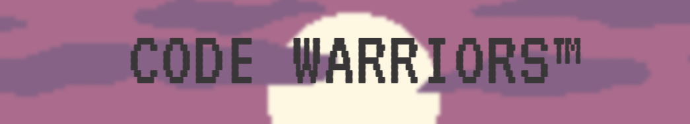
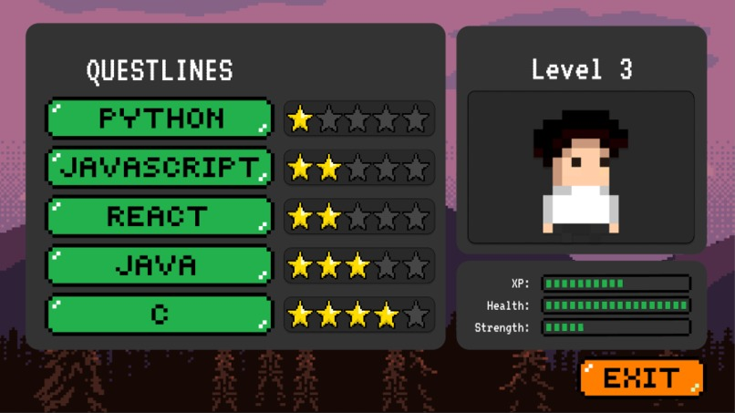
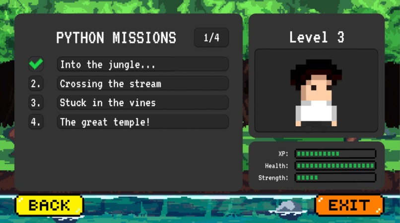
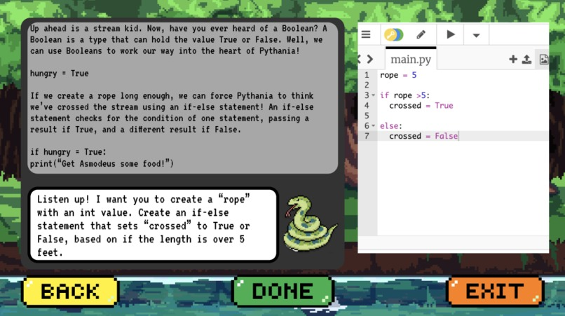
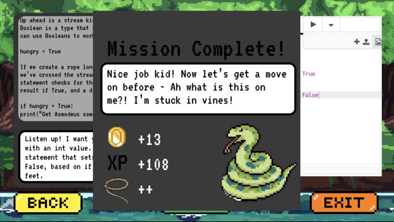

  

## Inspiration
It may have been the last day before an important exam, the first day at your job, or the start of your ambitious journey of learning a new language, where you were frustrated at the lack of engaging programming tutorials. It was impossible to get their "basics" down, as well as stay focused due to the struggle of navigating through the different tutorials trying to find the perfect one to solve your problems.

Code Warriors is a platform focused on encouraging the younger and older audience to learn how to code. Video games and programming are brought together to offer an engaging and fun way to learn how to code. Not only are you having fun, but you're constantly gaining new and meaningful skills!

## What it does
Code warriors hones your skills in all coding languages, all while levelling up your character and following the storyline!

  

 

Complete missions one at a time, not only learning new coding skills but getting immersed into each advancement in the questline!

  

 

As you follow Asmodeus the Python into the jungle of Pythania to find the lost amulet, you get to develop your skills in python by solving puzzles that incorporate data types, if statements, for loops, operators, and more. 

  

 

Once you finish each mission/storyline, you unlock new items, characters, XP, and coins which can help buy new storylines/coding languages to learn!

  

 

## How we built it
- We built code warriors by splitting our team into two to focus on two specific points of the project.
- The first team was the UI/UX team, which was tasked with creating the design of the website in Figma. This was important as we needed a team that could make our thoughts come to life in a short time, and design them nicely to make the website aesthetically pleasing.
- The second team was the frontend team, which was tasked with using ReactJS to create the final product, the website. They take what the UI/UX team has created, and add the logic and function behind it to serve as a real product.

## Challenges we ran into
The main challenge we faced was learning how to code with React. All of us had either basic/no experience with the language, so applying it to create code warriors was difficult. The main difficulties associated with this were organizing everything correctly, setting up the react-router to link pages, as well as setting up the compiler.

## Accomplishments that we're proud of
The first accomplishment we were proud of was setting up the login page. It takes only registered usernames and passwords, and will not let you login in without them. We are also proud of the gamified look we gave the website, as it gives the impression that the user is playing a game. Lastly, we are proud of having the compiler embedded in the website as it allows for a lot more user interaction and function to the website.

## What we learned
We learnt a lot about react, node, CSS, javascript, and tailwind. A lot of the syntax was new to us, as well as the applications of a lot of formatting options, such as padding, margins, and more. We learnt how to integrate tailwind with react, and how a lot of frontend programming works.

We also learnt how to efficiently split tasks as a team. We were lucky enough to see that our initial split up of the group into two teams worked, which is why we know that we can continue to use this strategy for future competitions, projects, and more.

## What's next for Code Warriors
What's next for code warriors is to add more lessons, integrate a full story behind the game, add more animations to give more of a game feel to it, as well as expand into different coding languages! The potential for code warriors is unlimited, and we can improve almost every aspect and expand the platform to proving a multitude of learning opportunities all while having an enjoyable experience.
